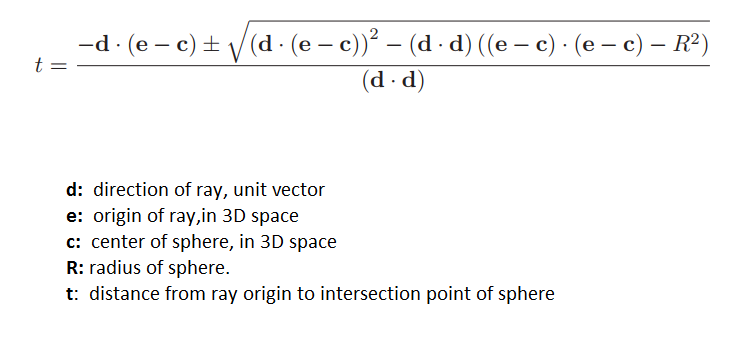
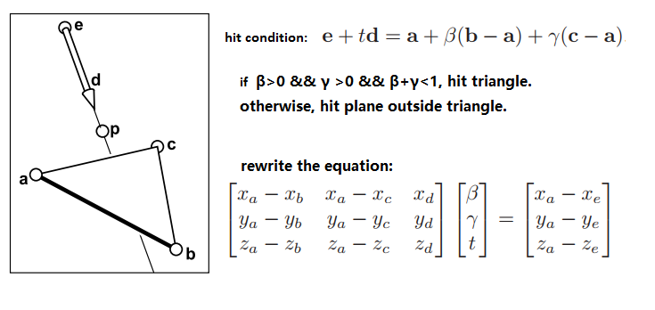
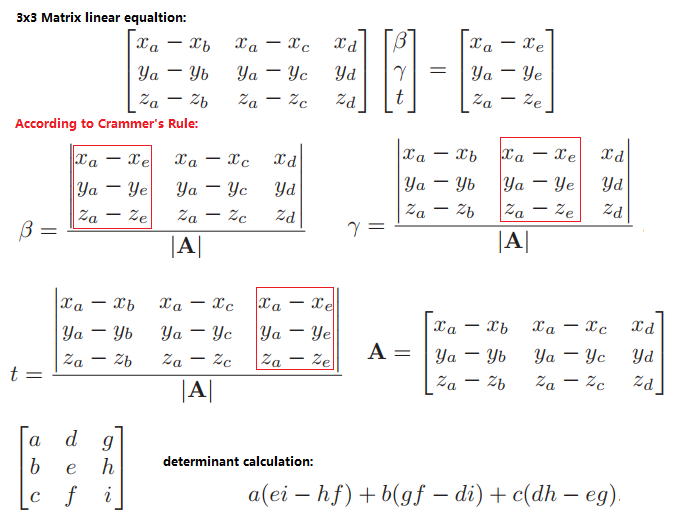

# Overview 

Simple path tracer in C++. It ports ForLoop multi-threads and progress reporter from pbrt-v3.


## Features
 - Mesh Rendering
 - Obj Model Import
 - Textures (PNG only at the moment)
 - Simple naive KD tree for meshes.
 - Diffuse, specular, and emission material types
 - Multi-Threading
 - solve 3x3 matrix linear equation
 
## Defects

- Ray and Shape intersection test is done in world space.
- Only sphere and triangle are supported.

## Compiling and Running
Requires cmake and OpenMP for multithreading.

Compile:
```
$ mkdir build
$ cd build
$ cmake ..
$ make
```
Run:
```
$ ./pathtracer <number-of-samples>
```
This will render the Stanford Dragon scene which is included.
Take a look at src/main.cpp to see how to create a scene amd import objs.

## Intersection test

### Ray-Sphere test



### Ray-Triangle test



### solve 3x3 matrix linear equation


